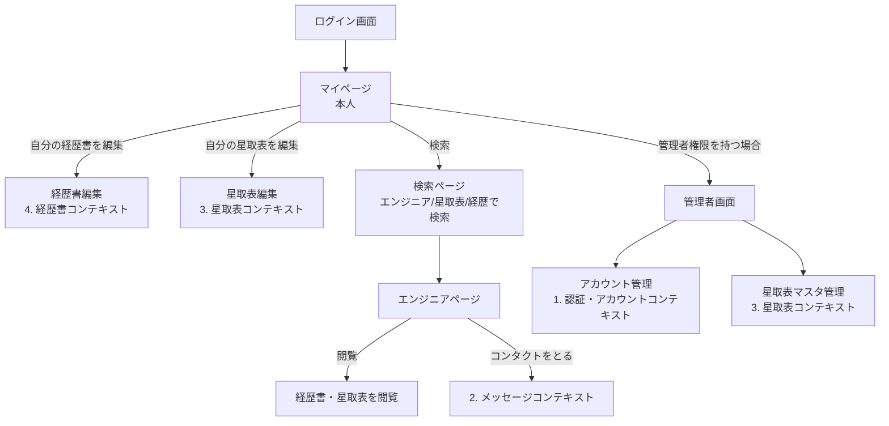
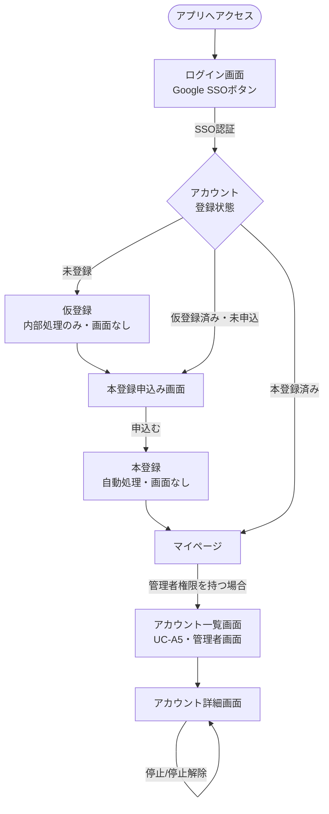
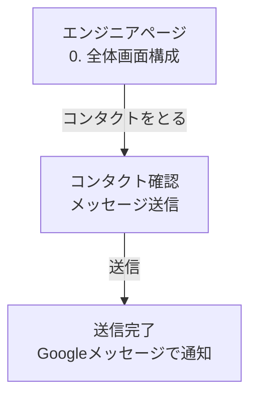
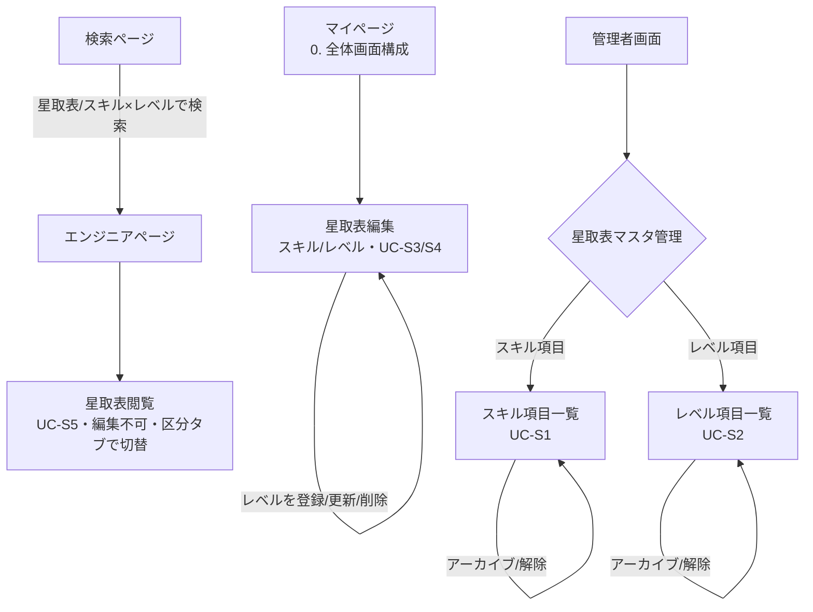
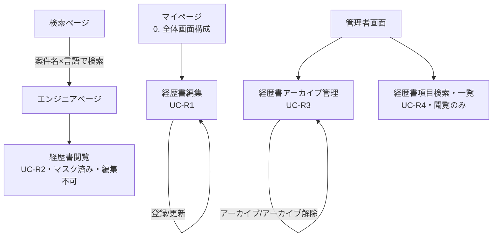
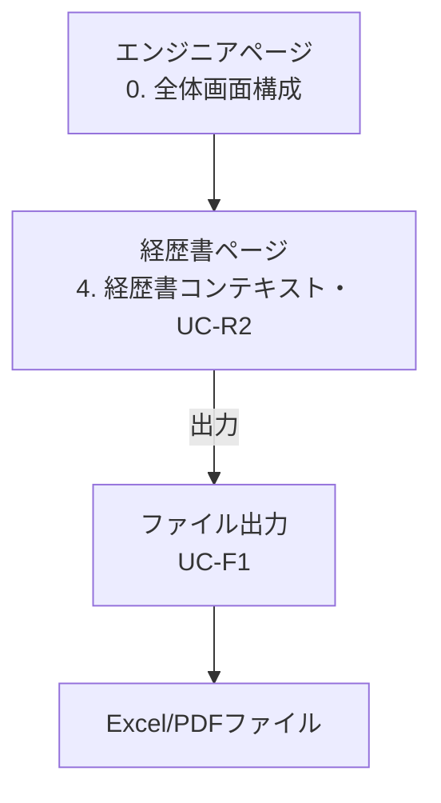

# ui-flows.md（ユースケース・画面遷移）

> ステータス: ドラフト完成（全6コンテキスト記載済み・検索条件・星取表レイアウト切替反映済み・レビュー中）

Miroのイベントストーミング結果（[inputs/miro/](inputs/miro/)）を元に、ユースケースと画面遷移（Mermaid）を定義する。

前提となるプロジェクトコンテキストは [README.md](README.md) を参照。対象コンテキストは [README.md 7章](README.md#7-イベントストーミング結果と業務ルール)記載の6コンテキスト（認証・アカウント・メッセージ・星取表・経歴書・ファイル）。

> 本ドキュメントはフロントエンド着手時の移行対象（[README.md 6章](README.md#6-フロントエンド関連ドキュメントの移行方針)）。

## 0. 全体画面構成

### アクター

| アクター | 説明 |
|---|---|
| ユーザー（本人） | ログインしている自分自身。マイページから自分の経歴書・星取表を操作する |
| ユーザー（本人以外） | 検索ページ経由で他のユーザー（エンジニア）の経歴書・星取表を閲覧する |
| ユーザー（管理者権限持ち） | 上記に加え、管理者画面（アカウント管理・各種マスタ管理）を操作する |

### 主要画面

| 画面 | 概要 |
|---|---|
| ログイン画面 | Google SSOログイン（[1. 認証・アカウントコンテキスト](#1-認証アカウントコンテキスト)） |
| マイページ | 本人用。自分の経歴書・星取表の編集ハブ |
| 検索ページ | エンジニア・星取表（スキル）・経歴を条件にユーザーを検索 |
| エンジニアページ | 検索結果から選択したユーザーの経歴書・星取表を閲覧（本人以外は閲覧のみ） |
| 管理者画面 | アカウント管理、星取表マスタ管理等（管理者権限持ちのみ） |

### 画面遷移

### 検索条件

検索ページでは、経歴書・星取表それぞれを対象に以下の条件で検索できる。いずれも単体（片方の条件のみ）での検索も可能とする（[quality-standards.md 1章](quality-standards.md#1-機能適合性functional-suitability)）。

| 検索対象 | 検索条件 | 対応データ |
|---|---|---|
| 経歴書 | 案件名 × 言語 | [data-models.md 4章](data-models.md#4-経歴書コンテキスト) `resumes` / `resume_projects` |
| 星取表 | 言語（ツール） × レベル | [data-models.md 3章](data-models.md#3-星取表コンテキスト) `user_skills` / `user_skill_levels` |

### 補足

- 本人が検索ページ経由で自分自身のエンジニアページに到達した場合も、マイページと同様に編集可能とする（同一画面の表示モード差異として扱う想定）。
- 各コンテキストのユースケース・詳細遷移は以降の章を参照。

## 1. 認証・アカウントコンテキスト

### ユースケース一覧

| ID | ユースケース | アクター | 概要 |
|---|---|---|---|
| UC-A1 | Google SSOログイン | 操作者 | Google SSOで認証し、アカウントの登録状態に応じて遷移先を振り分ける |
| UC-A2 | アカウント仮登録（内部処理） | システム | 未登録のGoogleアカウントでログインした場合、アカウントを仮登録する（画面なし） |
| UC-A3 | 本登録申込み | ユーザー（本人） | 仮登録状態のアカウントが、本登録を申し込む |
| UC-A4 | 本登録（自動処理） | システム | 本登録申込みを受けて、システムが自動的にアカウントを本登録する（管理者承認なし） |
| UC-A5 | アカウント一覧・検索 | ユーザー（管理者権限持ち） | 登録済みアカウントを検索・一覧表示する（管理者画面） |
| UC-A6 | 権限変更 | ユーザー（管理者権限持ち） | アカウントの権限（ロール）を変更する（管理者画面） |
| UC-A7 | アカウント停止／停止解除 | ユーザー（管理者権限持ち） | アカウントを停止・停止解除する（管理者画面） |

### 画面遷移

### 補足

- 「仮登録」「本登録（自動処理）」は内部状態遷移であり、専用画面は持たない。本登録申込み画面の送信操作をトリガーに、システムが自動でアカウントを本登録状態に遷移させる（管理者の承認は不要）。
- アカウント一覧・詳細画面（UC-A5〜A7）は[全体画面構成](#0-全体画面構成)の「管理者画面」に属し、管理者権限を持つユーザーのみアクセス可能。
- メッセージコンテキスト（コンタクト）との連携は [2. メッセージコンテキスト](#2-メッセージコンテキスト) で扱う。

## 2. メッセージコンテキスト

### ユースケース一覧

| ID | ユースケース | アクター | 概要 |
|---|---|---|---|
| UC-M1 | エンジニアへのコンタクト | ユーザー（本人以外／管理者権限持ち） | 検索ページ経由のエンジニアページから、対象エンジニアへGoogleメッセージでコンタクトを取る |

### 画面遷移

### 補足

- UC-M1（コンタクト）は[全体画面構成](#0-全体画面構成)の「エンジニアページ」からの導線として位置づける。
- イベントストーミング上の「アカウント承認依頼を送信する」（承認待ちフロー）は、Step1ではアカウント本登録が自動処理のため発生しない。Step1の対象外とする。
- **コンタクト経路**: Step1ではエンジニア間の直接コンタクト（上記の画面遷移）のみとし、営業担当を介する運用は対象外とする。「技術部門の方経由とするか、直接にするか」の論点はStep2（AIレコメンド検討時）にまとめて見直す（[docs/TODO.md](../TODO.md)）。

## 3. 星取表コンテキスト

主要機能②「星取表（技術スタック棚卸）」に対応。

### ユースケース一覧

| ID | ユースケース | アクター | 概要 |
|---|---|---|---|
| UC-S1 | 星取表マスタ（スキル項目）管理 | ユーザー（管理者権限持ち） | スキル項目の登録・更新・アーカイブ・アーカイブ解除（一括登録はSQL直入れのためAPI対象外） |
| UC-S2 | 星取表マスタ（レベル項目）管理 | ユーザー（管理者権限持ち） | レベル項目の登録・更新・アーカイブ・アーカイブ解除（一括登録はSQL直入れのためAPI対象外） |
| UC-S3 | 星取表（スキル）編集 | ユーザー（本人） | マイページから自分の星取表にスキルを登録・削除する |
| UC-S4 | 星取表（レベル）編集 | ユーザー（本人） | マイページから自分の星取表にレベルを登録・更新・削除する |
| UC-S5 | 星取表閲覧 | ユーザー（本人以外／管理者権限持ち） | 検索ページ→エンジニアページで他ユーザーの星取表を閲覧する（編集不可）。全項目を一画面に表示するのではなく、区分（[data-models.md 3章](data-models.md#3-星取表コンテキスト)の`skill_categories`/`level_categories`）単位のレイアウトタブで表示を切替可能とする |

### 画面遷移

### 補足

- 星取表マスタ（スキル項目／レベル項目）は「項目定義（マスタ）」、星取表（スキル／レベル）は「ユーザー個人の入力値」という関係（[README.md 7章](README.md#7-イベントストーミング結果と業務ルール)で確認済み）。
- 一括登録系（星取表マスタ一括登録、星取表一括登録（星取表CSV））はStep1ではAPI化せず、SQL直接投入で対応する。
- マスタのアーカイブ（廃止）もマスタ管理画面に含む。
- 検索ページの検索条件「星取表（スキル×レベル）」（[0章 検索条件](#検索条件)）は、UC-S1/S2で管理するスキル項目マスタ・レベル項目マスタを参照する想定。単体検索（スキルのみ／レベルのみ）も可能とする。
- スキル項目への「区分」付与は`skill_categories`（[data-models.md 3章](data-models.md#3-星取表コンテキスト)）として確定済み。UC-S5の星取表閲覧では、区分ごとのレイアウトタブ切替により、表示速度（[quality-standards.md 2章](quality-standards.md#2-性能効率性performance-efficiency)）を確保する。

## 4. 経歴書コンテキスト

主要機能①「経歴書のWeb化」に対応。

### ユースケース一覧

| ID | ユースケース | アクター | 概要 |
|---|---|---|---|
| UC-R1 | 経歴書編集（登録・更新） | ユーザー（本人） | マイページから自分の経歴書を登録・更新する |
| UC-R2 | 経歴書閲覧 | ユーザー（本人以外） | 検索ページ→エンジニアページで他ユーザーの経歴書を閲覧する（マスク済み・編集不可） |
| UC-R3 | 経歴書アーカイブ／アーカイブ解除 | ユーザー（管理者権限持ち） | 経歴書をアーカイブ・アーカイブ解除する（管理者画面） |
| UC-R4 | 経歴書項目検索・一覧 | ユーザー（管理者権限持ち） | 登録済み経歴書（[data-models.md 4章](data-models.md#4-経歴書コンテキスト)の`resumes`/`resume_projects`等）を検索・一覧表示する（管理者画面、閲覧のみ） |

### 画面遷移

### 補足

- 経歴書一括登録（経歴書CSV）はStep1ではAPI化せず、SQL直接投入で対応する（[README.md 7章](README.md#7-イベントストーミング結果と業務ルール)の方針と同様）。
- 検索ページの検索条件「経歴書（案件名×言語）」（[0章 検索条件](#検索条件)）は、`resumes`と`resume_projects`（[data-models.md 4章](data-models.md#4-経歴書コンテキスト)）をJOINして実現する。単体検索（案件名のみ／言語のみ）も可能とする。
- **マスク済み経歴書（UC-R2）**: 本人以外が閲覧する際は「最寄り駅」「最終学歴」をマスクする。年齢・自己PR・資格情報・案件経歴はマスクしない（`visibility_rules.target_category = resume_personal_info`、[data-models.md 4章](data-models.md#4-経歴書コンテキスト)）。ただし、本人または管理者（`resume_personal_info`を`can_view: true`とするロールを持つユーザー）が閲覧する場合はマスクせず表示する。
- **未確定事項**: イベントストーミング上のメモ「経歴書を更新するタイミングで星取表にスキルを反映できないか？」について、Step1での対応方針は未確定（要検討）。
- 経歴書は`resumes`/`resume_qualifications`/`resume_projects`の正規化テーブルで管理し、フォーマット変更（項目追加等）はテーブルへのカラム追加マイグレーションで対応する。キャリアシートのみを対象とするJSONBスキーマのバージョニング要件（[README.md 7章](README.md#7-イベントストーミング結果と業務ルール)）は経歴書には適用しない。

## 5. ファイルコンテキスト

### ユースケース一覧

| ID | ユースケース | アクター | 概要 |
|---|---|---|---|
| UC-F1 | 経歴書ファイル出力 | ユーザー（本人以外／管理者権限持ち） | 検索ページ→エンジニアページ→経歴書ページから、経歴書をファイル（Excel/PDF）として出力する |

### 画面遷移

### 補足

- 現状のユースケースは、検索ページ経由のエンジニアページから「経歴書・星取表を閲覧」→経歴書ページに遷移した際の出力を想定する（[4. 経歴書コンテキスト](#4-経歴書コンテキスト)のUC-R2と同一画面からの導線）。
- 出力形式はExcel（Jxls-poi）を正とし、PDFはheadless LibreOfficeで変換出力する（[README.md 4章](README.md#4-アーキテクチャ原則adr化予定の方針)の方針）。
- イベントストーミング上のアクター「ユーザー（営業）」も、本人以外として同様の操作を行う想定。
- **未確定事項**: 出力対象が経歴書のみか、星取表を含むか等は今後確認する。
