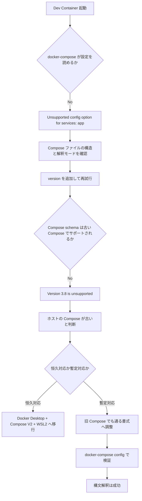

# Dev Container 起動エラーの整理

## 目次

- [第1回: Dev Container 起動エラー（Compose互換性）](#dev-container-起動エラーの整理)
  - [概要](#概要) / [発生したエラー](#発生したエラー) / [原因](#原因) / [対応方針](#対応方針) / [判断フロー](#判断フロー) / [再発防止メモ](#再発防止メモ)
- [第2回: DNS解決失敗 + コンテナ起動エラー（2026-05-02）](#第2回-dev-container-内-dns-解決失敗--コンテナ起動エラー2026-05-02)
  - [概要](#概要第2回) / [発生したエラー](#発生したエラー第2回) / [原因](#原因第2回) / [対応内容](#対応内容) / [再発防止メモ](#再発防止メモ第2回)

## 概要

Windows 上の旧 Docker 環境で Dev Container を起動した際、Docker Compose の互換性差分により `.devcontainer/docker-compose.yml` の解釈に失敗した。

今回のポイントは、Dev Containers 拡張自体の不具合ではなく、ホスト側の Docker / Docker Compose が古く、Compose ファイルの書式差分に追従できていなかったことにある。

## 発生環境

- OS: Windows
- Dev Containers: 0.457.0
- VS Code: 1.111.0
- Docker Engine: 19.03.12
- Docker Compose: 1.24.1
- Docker buildx: 未導入
- WSL: 未使用または利用不可
- Docker ホスト: `tcp://192.168.99.100:2376`（Docker Toolbox / docker-machine 系の構成を示唆）

## 発生したエラー

### 1. `Unsupported config option for services: 'app'`

以下のようなエラーが発生した。

```text
The Compose file '.../.devcontainer/docker-compose.yml' is invalid because:
Unsupported config option for services: 'app'
```

このエラーは、Compose ファイルの解釈モードと YAML 構造が噛み合っていないときに出る。

### 2. `Version ... is unsupported`

`version: '3.8'` を付けた後、以下のエラーに変わった。

```text
Version in ".../.devcontainer/docker-compose.yml" is unsupported.
You might be seeing this error because you're using the wrong Compose file version.
Either specify a supported version (e.g "2.2" or "3.3") and place your service definitions under the `services` key,
or omit the `version` key and place your service definitions at the root of the file to use version 1.
```

これは Docker Compose 1.24.1 が `3.8` をサポートしていないため。

## 原因

直接原因は、ホスト環境の Docker Compose が古いこと。

- Compose 1.24.1 は最近の Dev Container サンプルや Compose 記法と相性が悪い
- `3.8` のような比較的新しい Compose schema を解釈できない
- 一方で、`services:` を含む構造でも環境によっては読み取り方に差が出るため、設定変更時に別のエラーへ遷移しやすい

補助的なシグナルとして、以下も確認された。

- `docker buildx version` が失敗する
- WSL に接続できない
- Docker ホストが Docker Desktop ではなく `docker-machine` 系に見える

## 対応方針

### 推奨対応

ホスト環境を新しくする。

- Docker Desktop + Compose V2 に移行する
- 可能なら WSL2 ベースに寄せる
- Dev Containers の標準的な前提に合わせる

この対応が最も再発しにくい。

### 今回の暫定対応

古い Compose 環境でも解釈できる形に `.devcontainer/docker-compose.yml` を調整する。

今回の作業後、以下のコマンドは正常に通過した。

```powershell
docker-compose -f .devcontainer/docker-compose.yml config
```

そのため、少なくとも Compose の構文解釈段階は突破できる状態になっている。

## 判断フロー



## 再発防止メモ

- Dev Container の問題は、まずホストの Docker / Compose の世代差を疑う
- `docker compose version` と `docker-compose version` の両方を見る
- `docker-compose ... config` が通るかを最初の切り分けに使う
- `docker buildx` 未導入、WSL 不可、`docker-machine` 利用中なら、環境がかなり旧式である可能性が高い
- 新しい記事やサンプルの Compose 設定をそのまま旧環境へ持ち込まない

## 補足

今回の本質は「Dev Container が壊れている」ではなく、「Dev Container が前提にしている Docker 周辺バージョンにホスト側が追従していない」ことだった。

---

# 第2回: Dev Container 内 DNS 解決失敗 + コンテナ起動エラー（2026-05-02）

## 概要（第2回）

Docker Desktop + Compose V2 環境へ移行後、Dev Container 内から `api.github.com` 等の外部ホストへの名前解決がすべて失敗（`EAI_AGAIN`）し、GitHub Copilot が接続不能になった。  
また `docker-compose.yml` の `network_mode: service:db` 設定が原因で、Rebuild 時にコンテナがネットワーク不整合を起こした。

## 発生環境（第2回）

- OS: Windows 11 + WSL2
- Dev Containers: 0.457.0
- VS Code: 1.118.1
- Docker Desktop: 4.71.0
- Docker Engine: 29.4.1
- Docker Compose: 5.1.3 (Compose V2)

## 発生したエラー（第2回）

### 1. GitHub Copilot が全エンドポイントで `EAI_AGAIN`

Copilot の診断ログに以下が記録されていた。

```
DNS ipv4 Lookup: Error: getaddrinfo EAI_AGAIN api.github.com
DNS ipv4 Lookup: Error: getaddrinfo EAI_AGAIN api.githubcopilot.com
DNS ipv4 Lookup: Error: getaddrinfo EAI_AGAIN copilot-proxy.githubusercontent.com
```

WSL 自体（`wsl -e getent hosts api.github.com`）では名前解決できていたため、Dev Container コンテナ内のネットワーク設定が原因と特定。

### 2. `container is not connected to the network kakehashi-api_devcontainer_default`

Rebuild 時に以下のエラーで失敗した。

```
Error response from daemon: container 4553ab3f09f8... is not connected to the network kakehashi-api_devcontainer_default
```

`network_mode: service:db` で作られた古いコンテナが `--no-recreate` で再利用されようとし、新しい bridge ネットワークに接続できなかった。

### 3. `No space left on device`（docker-desktop WSL 内）

```
mkdir: can't create directory '...': No space left on device
```

Docker Desktop の VHD 内ストレージが枯渇していた（未使用イメージ 2.69 GB、未使用ボリューム 489 MB）。

## 原因（第2回）

| エラー | 直接原因 |
|---|---|
| `EAI_AGAIN` | `network_mode: service:db` により `app` が `db` のネットワーク名前空間を共有 → Docker の内部 DNS が利かない |
| `not connected to network` | `network_mode` 変更前に作成された旧コンテナが残存し、`--no-recreate` で再利用されようとした |
| `No space left on device` | Docker Desktop VHD 内に未使用イメージ・ボリュームが蓄積 |

補助シグナルとして、Windows シェルに `NO_PROXY=192.168.99.100` が残存していた（Docker Toolbox の残骸）。

## 対応内容

### (1) `.devcontainer/docker-compose.yml` の修正

`network_mode: service:db` を削除し、`app` と `db` を独立した通常の bridge ネットワークで接続するよう変更した。  
あわせて `db` に healthcheck を追加し、`app` が `db` ヘルシー後に依存起動するよう設定した。

```yaml
# 変更前（問題のある設定）
services:
  app:
    network_mode: service:db   # db のネットワーク名前空間を共有 → DNS 不可
    depends_on:
      - db

# 変更後
services:
  app:
    depends_on:
      db:
        condition: service_healthy  # healthcheck 後に起動
  db:
    healthcheck:
      test: ["CMD-SHELL", "pg_isready"]  # ユーザー名・DB名は指定しない
      interval: 10s
      timeout: 5s
      retries: 5

networks:
  default:
    driver: bridge
```

また廃止された `version:` キーも削除した（`docker compose config` の警告対応）。

### (2) 旧コンテナの削除

ネットワーク設定変更前の旧コンテナが残っていたため手動削除した。

```powershell
docker rm -f kakehashi-api_devcontainer-app-1 kakehashi-api_devcontainer-db-1
```

### (3) Docker Desktop ディスク解放

```powershell
docker system prune --volumes -f   # 未使用コンテナ・ネットワーク・ボリューム削除
docker image prune -a -f           # 未使用イメージ削除（約 870 MB 解放）
```

## 確認コマンド

```powershell
# Compose ファイルの構文検証
docker compose -f .devcontainer/docker-compose.yml config

# ディスク使用状況
docker system df
```

## 再発防止メモ（第2回）

- `network_mode: service:X` は「X のポートに直接アクセスしたい」特殊用途向け。通常の Dev Container では使わない
- Compose ファイルの `network_mode` を変更した場合は必ず旧コンテナを削除してから Rebuild する（`--no-recreate` によるコンテナ再利用がネットワーク不整合を起こす）
- `docker system df` で定期的にストレージを確認し、`docker image prune -a` で整理する
- WSL 側で名前解決できるのにコンテナ内で失敗する場合、まず `network_mode` と compose ネットワーク設定を疑う
- Docker Toolbox から移行した環境では `NO_PROXY=192.168.99.100` 等の残骸変数が残りやすい（PowerShell プロファイルや User スコープ環境変数を確認する）