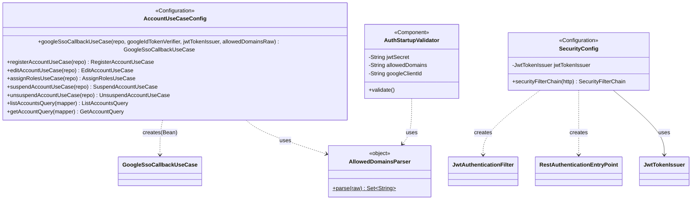

# config — Spring DI 配線・起動時設定

UseCase / Query の DI 登録、Spring Security 設定、起動時の設定値検証（fail-fast ガード）を担うレイヤー。`config` 層は全レイヤーに依存してよい（DI 配線のため、docs/architecture/package-structure.md）。ドメイン・ユースケース層には Spring アノテーションを持ち込まず、本層に閉じ込める（APP-ADR-0008）。

> **このファイルは `class-diagram-updater` エージェントによって自動生成・更新される。**
> 手動編集は次回の自動更新で上書きされるため、構造の変更はソースコードに対して行うこと。

---

## クラス図

---

## 各クラスの役割

| クラス | 種別 | 役割 |
|--------|------|------|
| `AccountUseCaseConfig` | `@Configuration` | UseCase / Query の `@Bean` 登録。UseCase クラス自体に `@Service` を付与しないことで、ユースケース層が Spring に依存しないことを型システムで保証する（APP-ADR-0008）。`app.auth.google.allowed-domains`（カンマ区切り）を `AllowedDomainsParser` でパースして `GoogleSsoCallbackUseCase` に注入する |
| `SecurityConfig` | `@Configuration` + `@EnableWebSecurity` | Spring Security 設定（APP-ADR-0014）。`POST /api/auth/google/callback` のみ未認証で許可し、それ以外は `JwtAuthenticationFilter` による自前 JWT 検証を通す。未認証アクセスは `RestAuthenticationEntryPoint` により常に 401 を返す（デフォルトの `Http403ForbiddenEntryPoint` フォールバックを回避）。ステートレス API のため CSRF・セッション管理を無効化する |
| `AuthStartupValidator` | `@Component`（`@Profile("!test & !integration-test")`） | 認証基盤の設定値を起動時に検証する fail-fast ガード（`@PostConstruct`）。`app.auth.jwt.secret` が開発用デフォルト値のまま・鍵長不足の場合、`app.auth.google.allowed-domains`（`AllowedDomainsParser` でのパース結果）が空の場合、または `app.auth.google.client-id`（`GoogleIdTokenVerifierImpl` の aud クレーム検証で使用）が空白のみの場合に `IllegalStateException` で起動を止める（PR #21 追加Copilot指摘対応） |
| `AllowedDomainsParser` | `internal object`（ユーティリティ） | `app.auth.google.allowed-domains` のパース処理（トリム・小文字化・空要素除外）を1箇所に集約する。`AccountUseCaseConfig` と `AuthStartupValidator` の双方から利用され、パース仕様の重複によるドリフトを防ぐ（PR #21 code-reviewer 指摘） |

---

## 関連 ADR

- [APP-ADR-0008](../../../../../../docs/adr/APP-ADR-0008-DDD-CQRSアーキテクチャ原則の採用.md) — DDD / CQRS（UseCase を POJO とし `@Configuration` で DI 登録する根拠）
- [APP-ADR-0014](../../../../../../docs/adr/APP-ADR-0014-JWT戦略-自前JWT発行を採用.md) — 認証基盤（Google SSO 検証・自前 JWT 発行戦略、鍵管理方針）
