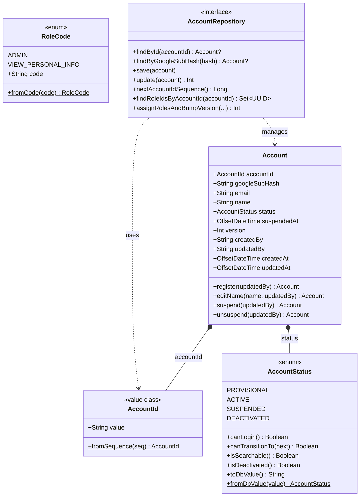
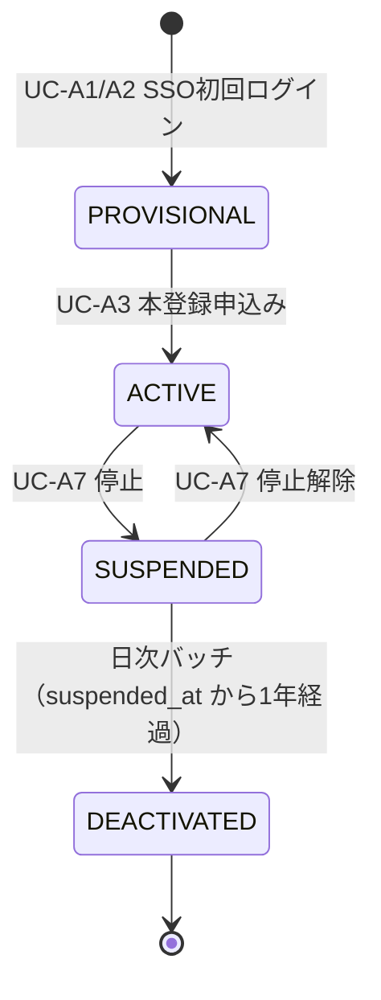

# domain/account — アカウントドメイン

アカウント集約（`Account`）を中心とするドメイン層。フレームワーク非依存の純粋な Kotlin で実装されており、Spring / MyBatis のアノテーションを持ち込まない（APP-ADR-0008）。

> **このファイルは `class-diagram-updater` エージェントによって自動生成・更新される。**  
> 手動編集は次回の自動更新で上書きされるため、構造の変更はソースコードに対して行うこと。

---

## クラス図

---

## ステータス遷移図

---

## 各クラスの役割

| クラス | 種別 | 役割 |
|--------|------|------|
| `Account` | data class（集約ルート） | アカウントの状態と振る舞いを表現。ステータス遷移メソッドを持ち、変更のたびに `version` をインクリメントする（APP-ADR-0005 楽観ロック） |
| `AccountId` | value class（値オブジェクト） | `AZ0001`〜`AZ9999` 形式の ID。PostgreSQL シーケンスから生成する |
| `AccountStatus` | enum | 遷移規則（`canTransitionTo`）を自身が持つ。状態ごとのログイン可否・検索可視性もここで管理（APP-ADR-0006） |
| `RoleCode` | enum | 権限コード（`admin` / `view_personal_info`）のマスタ。`roles` テーブルの `code` 列と対応（APP-ADR-0007） |
| `AccountRepository` | interface（ポート） | ドメイン層が依存するリポジトリ抽象。実装は `infrastructure/account/AccountRepositoryImpl` |

---

## 関連 ADR

- [APP-ADR-0005](../../../../../docs/adr/APP-ADR-0005-楽観ロックにversionカラム整数カウンタを採用.md) — 楽観ロック
- [APP-ADR-0006](../../../../../docs/adr/APP-ADR-0006-accounts.statusに4値設計（deactivated追加）と非adminからのsuspended-deactivated除外.md) — ステータス設計
- [APP-ADR-0007](../../../../../docs/adr/APP-ADR-0007-rolesをpermissionベースに再定義しvisibility_rulesを廃止.md) — 権限設計
- [APP-ADR-0008](../../../../../docs/adr/APP-ADR-0008-DDD-CQRSアーキテクチャ原則の採用.md) — DDD / CQRS
