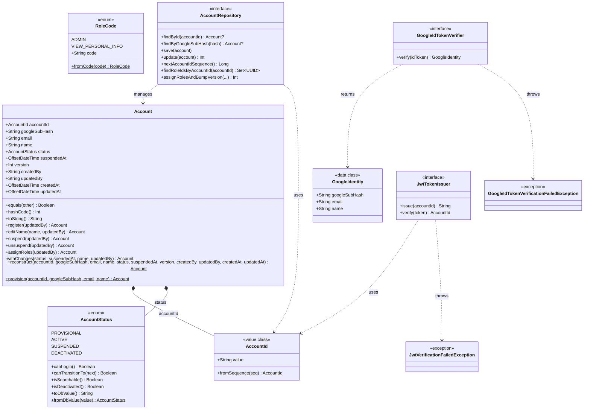
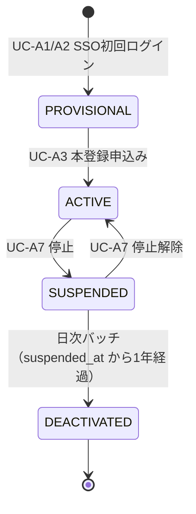

# domain/account — アカウントドメイン

アカウント集約（`Account`）を中心とするドメイン層。フレームワーク非依存の純粋な Kotlin で実装されており、Spring / MyBatis のアノテーションを持ち込まない（APP-ADR-0008）。認証基盤（Google SSO 検証・自前 JWT 発行）のポート（インターフェース）もここに定義する（APP-ADR-0014）。

> **このファイルは `class-diagram-updater` エージェントによって自動生成・更新される。**  
> 手動編集は次回の自動更新で上書きされるため、構造の変更はソースコードに対して行うこと。

---

## クラス図

---

## ステータス遷移図

---

## 各クラスの役割

| クラス | 種別 | 役割 |
|--------|------|------|
| `Account` | class（集約ルート） | アカウントの状態と振る舞いを表現。`private constructor` + companion object ファクトリ（`reconstruct()`＝永続化状態からの再構築、`provision()`＝新規発行）を持ち、ID 基準の `equals()`/`hashCode()`、PII 安全な `toString()`（`accountId`・`status` のみ出力）を実装する。ステータス遷移・`assignRoles()` 等の変更メソッドは全て private ヘルパー `withChanges()` を経由し、呼び出しのたびに `version` をインクリメントする（APP-ADR-0005 楽観ロック、APP-ADR-0015 通常 class 設計） |
| `AccountId` | value class（値オブジェクト） | `AZ0001`〜`AZ9999` 形式の ID。PostgreSQL シーケンスから生成する |
| `AccountStatus` | enum | 遷移規則（`canTransitionTo`）を自身が持つ。状態ごとのログイン可否（`canLogin`、APP-ADR-0014）・検索可視性もここで管理（APP-ADR-0006） |
| `RoleCode` | enum | 権限コード（`admin` / `view_personal_info`）のマスタ。`roles` テーブルの `code` 列と対応（APP-ADR-0007） |
| `AccountRepository` | interface（ポート） | ドメイン層が依存するリポジトリ抽象。実装は `infrastructure/account/AccountRepositoryImpl` |
| `GoogleIdTokenVerifier` | interface（ポート） | Google ID トークン検証の抽象。実装は `infrastructure/account/GoogleIdTokenVerifierImpl`（Google JWKS 署名検証、APP-ADR-0014） |
| `GoogleIdentity` | data class | 検証済みの Google アカウント情報（`googleSubHash` はハッシュ化済みで平文 sub は保持しない） |
| `JwtTokenIssuer` | interface（ポート） | 自前 JWT 発行・検証の抽象。実装は `infrastructure/account/JwtTokenIssuerImpl`（HS256、APP-ADR-0014） |

---

## ドメイン例外（ポート）

| 例外クラス | スロー元 | 捕捉先 |
|-----------|---------|--------|
| `GoogleIdTokenVerificationFailedException` | `GoogleIdTokenVerifier.verify()` | `usecase/account/GoogleSsoCallbackUseCase`（`GoogleIdTokenVerificationException` へ変換） |
| `JwtVerificationFailedException` | `JwtTokenIssuer.verify()` | `infrastructure/account/JwtAuthenticationFilter`（401 応答へ変換） |

---

## 関連 ADR

- [APP-ADR-0005](../../../../../../../docs/adr/APP-ADR-0005-楽観ロックにversionカラム整数カウンタを採用.md) — 楽観ロック
- [APP-ADR-0006](../../../../../../../docs/adr/APP-ADR-0006-accounts.statusに4値設計（deactivated追加）と非adminからのsuspended-deactivated除外.md) — ステータス設計
- [APP-ADR-0007](../../../../../../../docs/adr/APP-ADR-0007-rolesをpermissionベースに再定義しvisibility_rulesを廃止.md) — 権限設計
- [APP-ADR-0008](../../../../../../../docs/adr/APP-ADR-0008-DDD-CQRSアーキテクチャ原則の採用.md) — DDD / CQRS
- [APP-ADR-0014](../../../../../../../docs/adr/APP-ADR-0014-JWT戦略-自前JWT発行を採用.md) — 認証基盤（Google SSO 検証・自前 JWT 発行戦略）
- [APP-ADR-0015](../../../../../../../docs/adr/APP-ADR-0015-DDDエンティティは振る舞いを持つ通常classとして実装し値オブジェクトのdataclassと区別する.md) — DDD エンティティは通常 class として実装する方針
