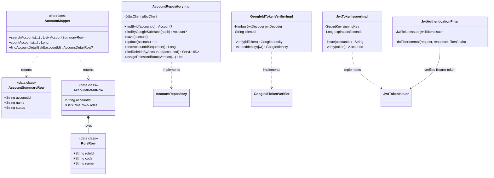

# infrastructure/account — アカウントインフラ層

ドメイン層のポート（`AccountRepository` / `GoogleIdTokenVerifier` / `JwtTokenIssuer`）の実装、および Query 系の MyBatis Mapper を提供する層。Spring・MyBatis・Nimbus・jjwt などの外部ライブラリ依存はこの層に閉じ込め、ドメイン・ユースケース層には持ち込まない（APP-ADR-0008）。

> **このファイルは `class-diagram-updater` エージェントによって自動生成・更新される。**
> 手動編集は次回の自動更新で上書きされるため、構造の変更はソースコードに対して行うこと。

---

## クラス図

---

## 各クラスの役割

| クラス | 種別 | 役割 |
|--------|------|------|
| `AccountRepositoryImpl` | `@Repository`（アダプタ） | `AccountRepository` の実装。`JdbcClient` による Command 系 DB アクセス。UPDATE 文は `WHERE version = ?` を条件に含め楽観ロックを実現する（APP-ADR-0005） |
| `AccountMapper` | `@Mapper`（MyBatis インターフェース） | Query 系（一覧・詳細取得）を DTO に直接マッピング。ドメイン層をバイパスする（APP-ADR-0008）。SQL 本体は `src/main/resources/mapper/account/AccountMapper.xml` |
| `AccountSummaryRow` / `AccountDetailRow` / `RoleRow` | data class（DTO） | `AccountMapper` の戻り値型。ドメインの `Account` とは別の Query 専用モデル |
| `GoogleIdTokenVerifierImpl` | `@Component`（アダプタ） | `GoogleIdTokenVerifier` の実装。Spring Security OAuth2 の `NimbusJwtDecoder` を Google JWKS で構成し、署名・iss/aud/exp・`email_verified` を検証する（APP-ADR-0014） |
| `JwtTokenIssuerImpl` | `@Component`（アダプタ） | `JwtTokenIssuer` の実装。jjwt による HS256 署名の自前 JWT を発行・検証する（有効期限60分固定、APP-ADR-0014） |
| `JwtAuthenticationFilter` | `OncePerRequestFilter` | `Authorization: Bearer <JWT>` を検証し `SecurityContextHolder` に accountId を principal としてセットするカスタムフィルター。`@Component` は付与せず `config/SecurityConfig` から明示的にインスタンス化する（`@WebMvcTest` の型スキャンに誤って取り込まれないため） |

---

## 関連 ADR

- [APP-ADR-0005](../../../../../../../docs/adr/APP-ADR-0005-楽観ロックにversionカラム整数カウンタを採用.md) — 楽観ロック
- [APP-ADR-0008](../../../../../../../docs/adr/APP-ADR-0008-DDD-CQRSアーキテクチャ原則の採用.md) — DDD / CQRS
- [APP-ADR-0014](../../../../../../../docs/adr/APP-ADR-0014-JWT戦略-自前JWT発行を採用.md) — 認証基盤（Google SSO 検証・自前 JWT 発行戦略）
