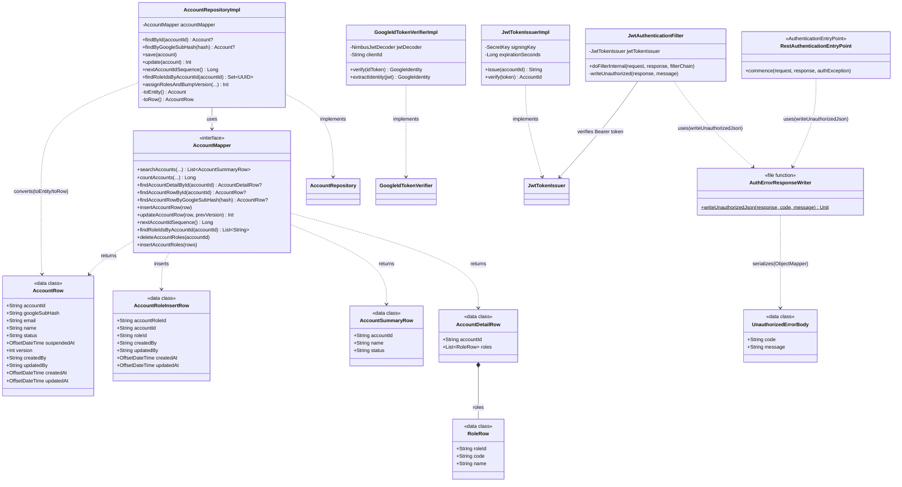

# infrastructure/account — アカウントインフラ層

ドメイン層のポート（`AccountRepository` / `GoogleIdTokenVerifier` / `JwtTokenIssuer`）の実装、および Query 系・Command 系の MyBatis Mapper（`AccountMapper`）を提供する層。Command 系も MyBatis に統一し、リフレクション対象を中間 DTO（`AccountRow`）に限定することで `Account` エンティティ本体（`private constructor`）には触れさせない（APP-ADR-0016）。Spring・MyBatis・Nimbus・jjwt・Jackson などの外部ライブラリ依存はこの層に閉じ込め、ドメイン・ユースケース層には持ち込まない（APP-ADR-0008）。

> **このファイルは `class-diagram-updater` エージェントによって自動生成・更新される。**
> 手動編集は次回の自動更新で上書きされるため、構造の変更はソースコードに対して行うこと。

---

## クラス図

---

## 各クラスの役割

| クラス | 種別 | 役割 |
|--------|------|------|
| `AccountRepositoryImpl` | `@Repository`（アダプタ） | `AccountRepository` の実装。`AccountMapper` 経由の MyBatis で Command 系 DB アクセスを行う（APP-ADR-0016）。`AccountRow` ↔ `Account` の詰め替え（`toEntity()`/`toRow()`）を一手に引き受ける「境界防波堤」であり、MyBatis のリフレクションが `private constructor` を持つ `Account` 本体に触れないようにする。UPDATE は `WHERE version = ?` を条件に含め楽観ロックを実現する（APP-ADR-0005） |
| `AccountMapper` | `@Mapper`（MyBatis インターフェース） | Query 系（一覧・詳細取得）と Command 系（単一集約の取得・挿入・更新・ロール全置換）の両方を担う。Query 系は JOIN 結果を DTO に直接マッピングしドメイン層をバイパスする（APP-ADR-0008）。Command 系はリフレクション対象を中間 DTO（`AccountRow`）に限定し、`Account` エンティティ本体には一度も触れない（APP-ADR-0016）。SQL 本体は `src/main/resources/mapper/account/AccountMapper.xml` |
| `AccountRow` | data class（Command 系中間 DTO） | `AccountMapper` の Command 系メソッドが読み書きする中間表現。`AccountRepositoryImpl` が `Account.reconstruct()`/`toRow()` で相互変換する（APP-ADR-0016） |
| `AccountRoleInsertRow` | data class（DTO） | `account_roles` 一括挿入用 DTO（UC-A6 ロール全置換） |
| `AccountSummaryRow` / `AccountDetailRow` / `RoleRow` | data class（Query 系 DTO） | `AccountMapper` の Query 系メソッドの戻り値型。ドメインの `Account` とは別の Query 専用モデル |
| `GoogleIdTokenVerifierImpl` | `@Component`（アダプタ） | `GoogleIdTokenVerifier` の実装。Spring Security OAuth2 の `NimbusJwtDecoder` を Google JWKS で構成し、署名・iss/aud/exp・`email_verified` を検証する（APP-ADR-0014） |
| `JwtTokenIssuerImpl` | `@Component`（アダプタ） | `JwtTokenIssuer` の実装。jjwt による HS256 署名の自前 JWT を発行・検証する（有効期限60分固定、APP-ADR-0014）。`verify()` は `JwtException` に加え `IllegalArgumentException`（jjwt が空文字列等の形式不正入力で投げることがある）も捕捉し `JwtVerificationFailedException` にラップする。捕捉範囲を広げないと 401 ではなく 500 Internal Server Error になってしまうため |
| `JwtAuthenticationFilter` | `OncePerRequestFilter` | `Authorization: Bearer <JWT>` を検証し `SecurityContextHolder` に accountId を principal としてセットするカスタムフィルター。`@Component` は付与せず `config/SecurityConfig` から明示的にインスタンス化する（`@WebMvcTest` の型スキャンに誤って取り込まれないため）。Bearer スキームの判定は大文字小文字を区別しない（`startsWith(..., ignoreCase = true)`）。トークンはトリムしてから検証する（スキームとの間の余分な空白を許容するため、PR #21 追加Copilot指摘対応）。検証失敗時は `AuthErrorResponseWriter.writeUnauthorizedJson` で401 JSONを書き込む |
| `RestAuthenticationEntryPoint` | `AuthenticationEntryPoint`（アダプタ） | 未認証アクセス時に常に401を返す。`httpBasic()`/`formLogin()` を設定しない構成では Spring Security のデフォルト実装が `Http403ForbiddenEntryPoint` にフォールバックし403になってしまうため明示的に登録する（PR #21 code-reviewer 指摘）。`@Component` は付与せず `config/SecurityConfig` から明示的にインスタンス化する（`JwtAuthenticationFilter` と同じ方針） |
| `AuthErrorResponseWriter.kt`（`writeUnauthorizedJson`） | `internal` トップレベル関数 | 401 JSONレスポンス（`{"code":...,"message":...}`）書き込みの共通処理。`JwtAuthenticationFilter`（JWT検証失敗時）と `RestAuthenticationEntryPoint`（未認証アクセス時）で応答フォーマットを統一するために共通化（PR #21 code-reviewer 指摘）。シリアライズは Jackson の `ObjectMapper`（`authErrorObjectMapper`）に `UnauthorizedErrorBody` を渡す方式に変更（手書きの文字列エスケープでは制御文字を含むメッセージで不正な JSON になるため、PR #21 追加Copilot指摘対応） |
| `UnauthorizedErrorBody` | `private data class` | 401 レスポンスの JSON ボディ（`{"code":...,"message":...}`）を表す。`AuthErrorResponseWriter.kt` 内に閉じたシリアライズ専用モデル |

---

## 関連 ADR

- [APP-ADR-0005](../../../../../../../docs/adr/APP-ADR-0005-楽観ロックにversionカラム整数カウンタを採用.md) — 楽観ロック
- [APP-ADR-0008](../../../../../../../docs/adr/APP-ADR-0008-DDD-CQRSアーキテクチャ原則の採用.md) — DDD / CQRS
- [APP-ADR-0014](../../../../../../../docs/adr/APP-ADR-0014-JWT戦略-自前JWT発行を採用.md) — 認証基盤（Google SSO 検証・自前 JWT 発行戦略）
- [APP-ADR-0016](../../../../../../../docs/adr/APP-ADR-0016-Repository実装をMyBatis統一しリフレクション対象を中間DTOに限定する.md) — Repository 実装を MyBatis に統一し、リフレクション対象を中間 DTO に限定
