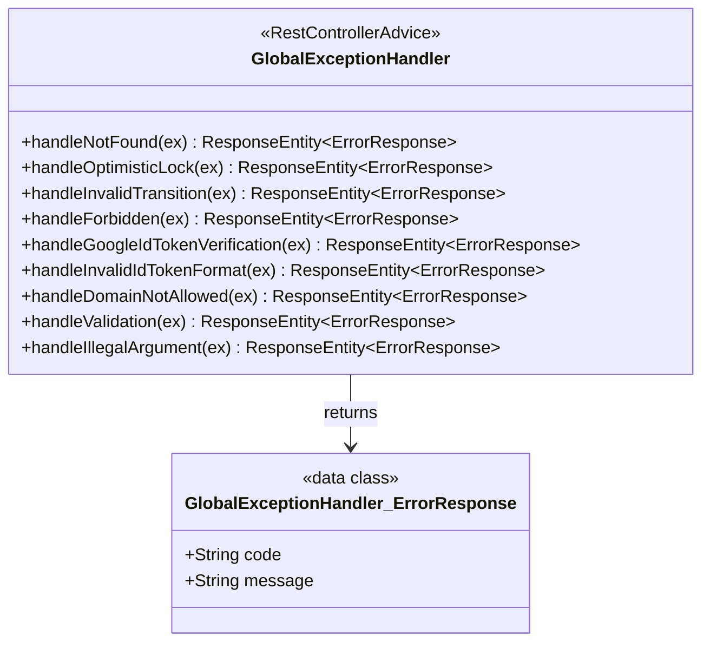

# presentation — グローバル例外ハンドラ

各層（主に usecase 層）がスローする業務例外を HTTP レスポンスへ変換する横断的関心事を扱うパッケージ。エンドポイント固有のコントローラは `presentation/account` 等のサブパッケージに配置し、本パッケージ直下には `@RestControllerAdvice` のみを置く。

> **このファイルは `class-diagram-updater` エージェントによって自動生成・更新される。**
> 手動編集は次回の自動更新で上書きされるため、構造の変更はソースコードに対して行うこと。

---

## クラス図

---

## 例外 → HTTP レスポンス変換

| 例外クラス | HTTP | code | 由来 |
|-----------|------|------|------|
| `AccountNotFoundException` | 404 | `ACCOUNT_NOT_FOUND` | usecase/account |
| `OptimisticLockException` | 409 | `OPTIMISTIC_LOCK_CONFLICT` | usecase/account（APP-ADR-0005） |
| `InvalidStatusTransitionException` | 409 | `INVALID_STATUS_TRANSITION` | usecase/account |
| `ForbiddenOperationException` | 403 | `FORBIDDEN` | usecase/account |
| `GoogleIdTokenVerificationException` | 401 | `GOOGLE_ID_TOKEN_VERIFICATION_FAILED` | usecase/account（UC-A1、APP-ADR-0014） |
| `InvalidIdTokenFormatException` | 422 | `INVALID_ID_TOKEN_FORMAT` | usecase/account（UC-A1、APP-ADR-0014） |
| `DomainNotAllowedException` | 422 | `DOMAIN_NOT_ALLOWED` | usecase/account（UC-A1、APP-ADR-0014） |
| `MethodArgumentNotValidException` | 400 | `VALIDATION_ERROR` | Spring（`@Valid`） |
| `IllegalArgumentException` | 400 | `BAD_REQUEST` | ドメイン層（`AccountId` フォーマット不正等） |

`JwtVerificationFailedException`（自前 JWT 検証失敗）は `GlobalExceptionHandler` を経由せず、`infrastructure/account/JwtAuthenticationFilter` が直接 401 応答を書き込む（`@RestControllerAdvice` はサーブレットフィルター層には適用されないため）。

---

## 関連 ADR

- [APP-ADR-0005](../../../../../../docs/adr/APP-ADR-0005-楽観ロックにversionカラム整数カウンタを採用.md) — 楽観ロック
- [APP-ADR-0014](../../../../../../docs/adr/APP-ADR-0014-JWT戦略-自前JWT発行を採用.md) — 認証基盤（Google SSO 検証・自前 JWT 発行戦略）
