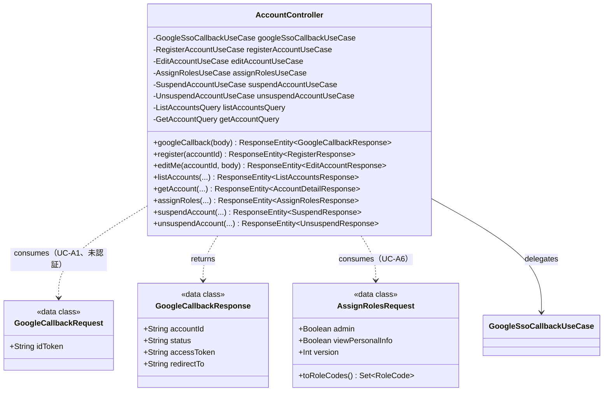
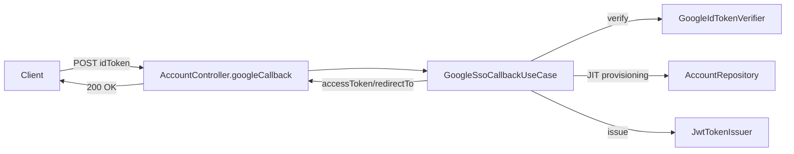

# presentation/account — アカウント・ロール REST API

アカウント・ロールドメインの REST エンドポイントを提供するコントローラ層。UseCase / Query を呼び出し、リクエスト/レスポンス DTO への変換のみを担う（業務ロジックは持たない）。共通の例外 → HTTP 変換は `presentation/GlobalExceptionHandler` が担当する。

> **このファイルは `class-diagram-updater` エージェントによって自動生成・更新される。**
> 手動編集は次回の自動更新で上書きされるため、構造の変更はソースコードに対して行うこと。

---

## クラス図

---

## エンドポイント一覧

| メソッド | パス | UseCase / Query | 設計書No | 認証 |
|---------|------|-----------------|---------|------|
| POST | `/api/auth/google/callback` | `GoogleSsoCallbackUseCase` | UC-A1 | 未認証（`permitAll`、APP-ADR-0014） |
| POST | `/api/accounts/me/registration` | `RegisterAccountUseCase` | UC-A3 | `X-Account-Id`（暫定ヘッダー方式、exec-plan 0007 で `@PreAuthorize` へ移行予定） |
| PATCH | `/api/accounts/me` | `EditAccountUseCase` | UC-A4 | 同上 |
| GET | `/api/accounts` | `ListAccountsQuery` | UC-A5 | 同上（`X-Is-Admin` で管理者判定） |
| GET | `/api/accounts/{accountId}` | `GetAccountQuery` | - | 同上（非管理者は自分のみ参照可） |
| PUT | `/api/accounts/{accountId}/roles` | `AssignRolesUseCase` | UC-A6 | 同上（管理者のみ） |
| POST | `/api/accounts/{accountId}/suspend` | `SuspendAccountUseCase` | UC-A7 | 同上（管理者のみ） |
| POST | `/api/accounts/{accountId}/unsuspend` | `UnsuspendAccountUseCase` | UC-A7 | 同上（管理者のみ） |

`X-Account-Id` / `X-Is-Admin` ヘッダーは、`SecurityContextHolder` からの accountId 取得・`@PreAuthorize` による認可（exec-plan 0007）が未実装のための暫定的な認証・認可方式である。UC-A1 のみ APP-ADR-0014 に基づき Google ID トークン検証・自前 JWT 発行を実装済み。

---

## データフロー（UC-A1: Google SSO コールバック）

---

## 関連 ADR

- [APP-ADR-0009](../../../../../../../docs/adr/APP-ADR-0009-APIパスにバージョンプレフィックスを含めない.md) — API パス設計
- [APP-ADR-0014](../../../../../../../docs/adr/APP-ADR-0014-JWT戦略-自前JWT発行を採用.md) — 認証基盤（Google SSO 検証・自前 JWT 発行戦略）
