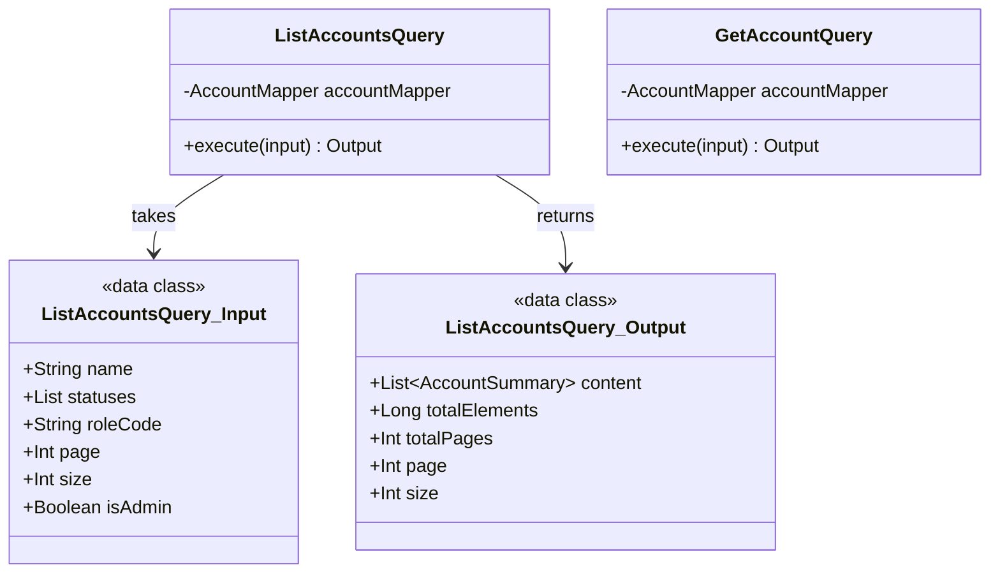
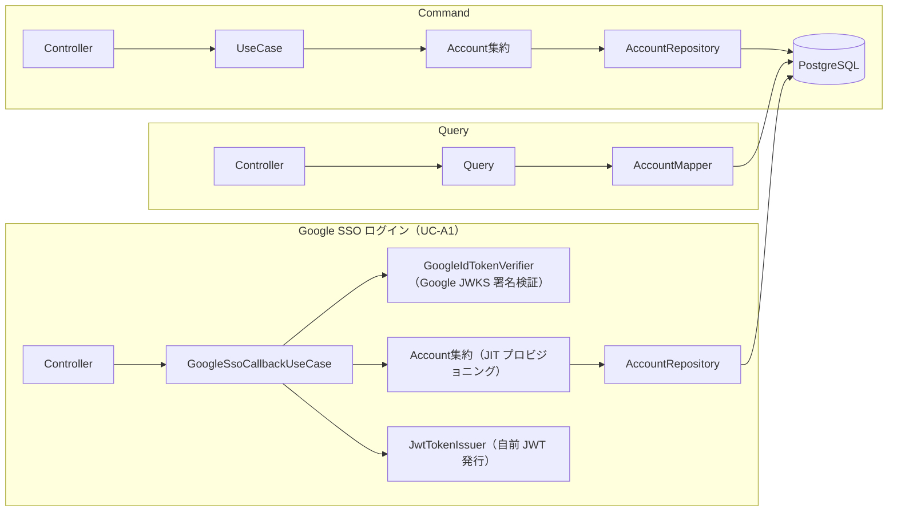

# usecase/account — アカウントユースケース層

アカウントドメインのビジネスロジックを UseCase / Query として実装する層。CQRS 原則（APP-ADR-0008）に従い、状態変更（Command）と参照（Query）を分離している。

> **このファイルは `class-diagram-updater` エージェントによって自動生成・更新される。**  
> 手動編集は次回の自動更新で上書きされるため、構造の変更はソースコードに対して行うこと。

---

## クラス図（Command 系 UseCase）

```mermaid
classDiagram
    class RegisterAccountUseCase {
        -AccountRepository accountRepository
        +execute(accountId) Output
    }
    class RegisterAccountUseCase_Output {
        <<data class>>
        +String accountId
        +AccountStatus status
    }

    class EditAccountUseCase {
        -AccountRepository accountRepository
        +execute(input) Output
    }
    class EditAccountUseCase_Input {
        <<data class>>
        +AccountId accountId
        +String name
        +Int version
    }

    class SuspendAccountUseCase {
        -AccountRepository accountRepository
        +execute(input) Output
    }

    class UnsuspendAccountUseCase {
        -AccountRepository accountRepository
        +execute(input) Output
    }

    class AssignRolesUseCase {
        -AccountRepository accountRepository
        -ADMIN_ROLE_ID$ UUID
        -VIEW_PERSONAL_INFO_ROLE_ID$ UUID
        +roleIdFor(roleCode)$ UUID
        +execute(input) Output
    }
    class AssignRolesUseCase_Input {
        <<data class>>
        +AccountId targetAccountId
        +String operatorAccountId
        +Boolean operatorIsAdmin
        +Boolean grantAdminRole
        +Boolean grantViewPersonalInfoRole
        +Int version
    }

    class GoogleSsoCallbackUseCase {
        -AccountRepository accountRepository
        -GoogleIdTokenVerifier googleIdTokenVerifier
        -JwtTokenIssuer jwtTokenIssuer
        -Set~String~ allowedGoogleDomains
        +execute(input) Output
    }
    class GoogleSsoCallbackUseCase_Output {
        <<data class>>
        +String accountId
        +AccountStatus status
        +String accessToken
        +String redirectTo
    }

    RegisterAccountUseCase --> RegisterAccountUseCase_Output : returns
    GoogleSsoCallbackUseCase --> GoogleSsoCallbackUseCase_Output : returns
    GoogleSsoCallbackUseCase ..> GoogleIdTokenVerifier : verifies idToken
    GoogleSsoCallbackUseCase ..> JwtTokenIssuer : issues accessToken
    EditAccountUseCase --> EditAccountUseCase_Input : takes
    AssignRolesUseCase --> AssignRolesUseCase_Input : takes
```

## クラス図（Query 系）

---

## UseCase / Query 一覧

### Command 系（ドメイン集約を経由してDBを更新）

| クラス | 設計書No | 概要 |
|--------|---------|------|
| `GoogleSsoCallbackUseCase` | UC-A1/A2 | Google SSO コールバック処理。Google IDトークン検証 → JIT プロビジョニング（初回ログイン時に仮登録アカウントを作成）→ 自前 JWT 発行の3段構成（APP-ADR-0014） |
| `RegisterAccountUseCase` | UC-A3 | 本登録申込み。PROVISIONAL → ACTIVE へステータス遷移 |
| `EditAccountUseCase` | UC-A4 | アカウント情報（表示名）を編集 |
| `SuspendAccountUseCase` | UC-A7 | アカウントを停止（ACTIVE → SUSPENDED） |
| `UnsuspendAccountUseCase` | UC-A7 | アカウント停止を解除（SUSPENDED → ACTIVE） |
| `AssignRolesUseCase` | UC-A6 | 権限（admin / view_personal_info）を管理者が付与・変更 |

### Query 系（MyBatis Mapper → DTO 直接マッピング、ドメイン層バイパス）

| クラス | 設計書No | 概要 |
|--------|---------|------|
| `ListAccountsQuery` | UC-A5 | アカウント一覧・検索（ページング / ステータス / 権限 / 名前絞り込み） |
| `GetAccountQuery` | UC-A5 | アカウント詳細取得（roles 含む） |

---

## データフロー

---

## 共通例外（exception/）

| 例外クラス | HTTP | 発生条件 |
|-----------|------|---------|
| `AccountNotFoundException` | 404 | 指定 ID のアカウントが存在しない |
| `InvalidStatusTransitionException` | 409 | `canTransitionTo()` が false |
| `OptimisticLockException` | 409 | UPDATE 0件（version 不一致） |
| `ForbiddenOperationException` | 403 | 権限不足（`isAdmin = false`）、または `AccountStatus.canLogin()` が false（UC-A1: suspended/deactivated アカウントのログイン試行） |
| `GoogleIdTokenVerificationException` | 401 | Google JWKS による署名・iss/aud/有効期限の検証に失敗（UC-A1、APP-ADR-0014） |
| `InvalidIdTokenFormatException` | 422 | idToken が JWT フォーマット（`header.payload.signature`）として不正（UC-A1、APP-ADR-0014） |
| `DomainNotAllowedException` | 422 | 許可ドメイン（`app.auth.google.allowed-domains`）に一致しない Google アカウント（UC-A1、APP-ADR-0014） |

---

## 関連 ADR

- [APP-ADR-0005](../../../../../../../docs/adr/APP-ADR-0005-楽観ロックにversionカラム整数カウンタを採用.md) — 楽観ロック
- [APP-ADR-0006](../../../../../../../docs/adr/APP-ADR-0006-accounts.statusに4値設計（deactivated追加）と非adminからのsuspended-deactivated除外.md) — ステータス可視性制御（GetAccountQuery / ListAccountsQuery）
- [APP-ADR-0007](../../../../../../../docs/adr/APP-ADR-0007-rolesをpermissionベースに再定義しvisibility_rulesを廃止.md) — 権限設計
- [APP-ADR-0008](../../../../../../../docs/adr/APP-ADR-0008-DDD-CQRSアーキテクチャ原則の採用.md) — DDD / CQRS
- [APP-ADR-0014](../../../../../../../docs/adr/APP-ADR-0014-JWT戦略-自前JWT発行を採用.md) — 認証基盤（Google SSO 検証・自前 JWT 発行戦略）
